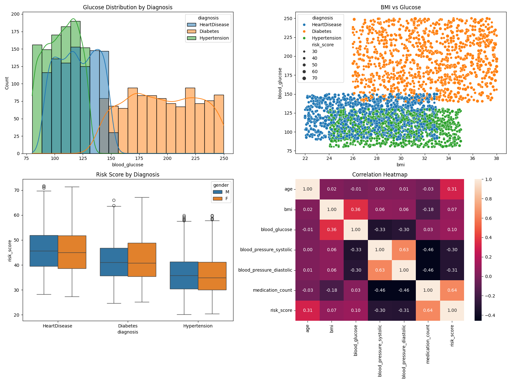

# Chronic Disease Management System

## About the Project

This project is a Chronic Disease Management System developed as part of a Python programming project.

The system manages patient information and medical records, cleans and loads data from a CSV file, performs statistical analyses, creates data visualizations, and uses RabbitMQ to handle analysis and visualization tasks.

The project was designed using object-oriented programming principles and includes the Singleton and Factory design patterns.

---

## Project Structure

chronic_disease_system/
│
├── data/
│   └── patients_data.csv
│
├── reports/
│   ├── age_distribution_pyramid_chart.png
│   ├── bmi_vs_glucose_scatter_plot.png
│   ├── correlation_heatmap.png
│   ├── dashboard.png
│   ├── distribution_by_diagnosis_histogram_plot.png
│   ├── risk_score_by_diagnosis_gender_boxplot.png
│   └── summary_report.txt
│
├── src/
│   ├── analysis/
│   │   ├── statistics.py
│   │   └── visualizations.py
│   │
│   ├── models/
│   │   ├── clinic.py
│   │   ├── medical_record.py
│   │   └── patient.py
│   │
│   └── utils/
│       └── data_loader.py
│
├── docker_commands.txt
├── main.py
├── producer.py
└── requirements.txt

---

## Main Components

### Patient

The `Patient` class contains the basic information of a patient, including:

- Patient ID
- Name
- Age
- Gender
- Diagnosis
- Diagnosis date

It also includes methods for displaying the patient's profile, checking whether a patient is a senior, determining the patient's age group, and converting the patient's information to a dictionary.

### MedicalRecord

The `MedicalRecord` class contains the medical information of a patient, including:

- Blood glucose
- Systolic and diastolic blood pressure
- BMI
- HbA1c
- Cholesterol
- Last visit
- Smoking status
- Medication count
- Risk score

It also includes methods for checking whether a patient is high risk, determining the BMI category, checking hypertension, and converting the record to a dictionary.

### Clinic

The `Clinic` class manages the patients and their medical records.

Each patient is connected to their medical record using the patient ID.

The class uses the Singleton design pattern, so only one `Clinic` instance is created.

---

## Data Loading

The `data_loader.py` module is responsible for loading the patient data from the CSV file.

Before creating the objects, the data is cleaned and validated. This includes:

- Handling missing values
- Converting numeric values
- Cleaning gender values
- Validating diagnoses
- Converting date values
- Handling invalid values

Factory functions are used to create `Patient` and `MedicalRecord` objects from each CSV row.

The valid patients and their medical records are then added to the `Clinic` object.

---

## Statistical Analysis

The `statistics.py` module contains the statistical analysis functions.

The analyses include:

- Diagnosis statistics
- Age group analysis
- Risk factor correlation
- Medication burden analysis
- Time since diagnosis analysis
- Full statistical report

The statistical report is saved as:

`reports/summary_report.txt`

The module also contains a RabbitMQ consumer that receives statistical tasks and runs the appropriate analysis.

---

## Data Visualizations

The `visualizations.py` module generates several graphs using Matplotlib and Seaborn.

The visualizations include:

- Glucose distribution by diagnosis
- BMI vs. blood glucose by diagnosis and risk score
- Risk score by diagnosis and gender
- Age distribution by gender
- Correlation heatmap
- A dashboard combining several graphs

The generated visualizations are saved in the `reports` folder.

### Dashboard

---

## RabbitMQ

RabbitMQ is used to send analysis and visualization tasks between the Flask producer and the consumers.

The general flow is:

Flask Producer
      |
      v
tasks_exchange
      |
      +----------------------+
      |                      |
      v                      v
statistics_queue     visualizations_queue
      |                      |
      v                      v
Statistics Consumer   Visualizations Consumer

The producer receives requests through Flask URLs and sends the requested task to RabbitMQ.

RabbitMQ routes the task using routing keys:

- `statistics` → `statistics_queue`
- `visualizations` → `visualizations_queue`

The appropriate consumer receives the task and runs the requested analysis or visualization.

Manual acknowledgements are used in both consumers (`auto_ack=False`).

The message is acknowledged using `basic_ack()` only after the task has been processed successfully.

RabbitMQ is run using Docker.

---

## Technologies

The project uses:

- Python
- Pandas
- Matplotlib
- Seaborn
- Flask
- RabbitMQ
- Pika
- Docker

---

## Installation

First, install the required Python packages:

pip install -r requirements.txt

RabbitMQ can be started using Docker with the following command:

docker run -d --name chronic-rabbitmq -p 5672:5672 -p 15672:15672 rabbitmq:3-management

For additional RabbitMQ and running instructions, see `docker_commands.txt`.

---

## Running the Project

### Run the Statistics Consumer

python -m src.analysis.statistics

### Run the Visualizations Consumer

python -m src.analysis.visualizations

### Run the Flask Producer

python producer.py

### Run the Main Program

The main program can be used to generate the statistical report, generate visualizations, or run the interactive menu.

To generate the statistical report:

python main.py --report

To generate the visualizations:

python main.py --visualize

To run the interactive menu:

python main.py --interactive

---

## Interactive Menu

When running the project with the `--interactive` option, the user can:

1. Search for a patient by ID
2. Show a full patient profile
3. Run a specific statistical analysis
4. Exit the program

---

## Example API URLs

After running the Flask producer, tasks can be sent through the following URLs.

### Statistics

http://127.0.0.1:5000/statistics/risk_factor_correlation

http://127.0.0.1:5000/statistics/generate_full_report

### Visualizations

http://127.0.0.1:5000/visualizations/plot_bmi_vs_glucose

http://127.0.0.1:5000/visualizations/generate_dashboard

---

## Reports

Generated statistical reports and visualizations are saved in the `reports` folder.

The folder contains the statistical report, individual visualization files, and the generated dashboard.

---

## Authors

Tamar Levitan

Ayelet Yehezkel